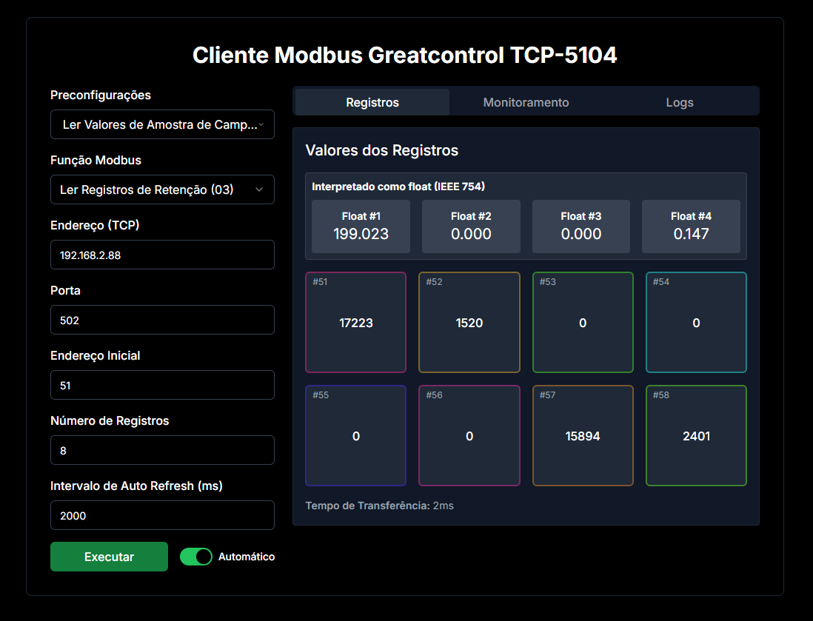
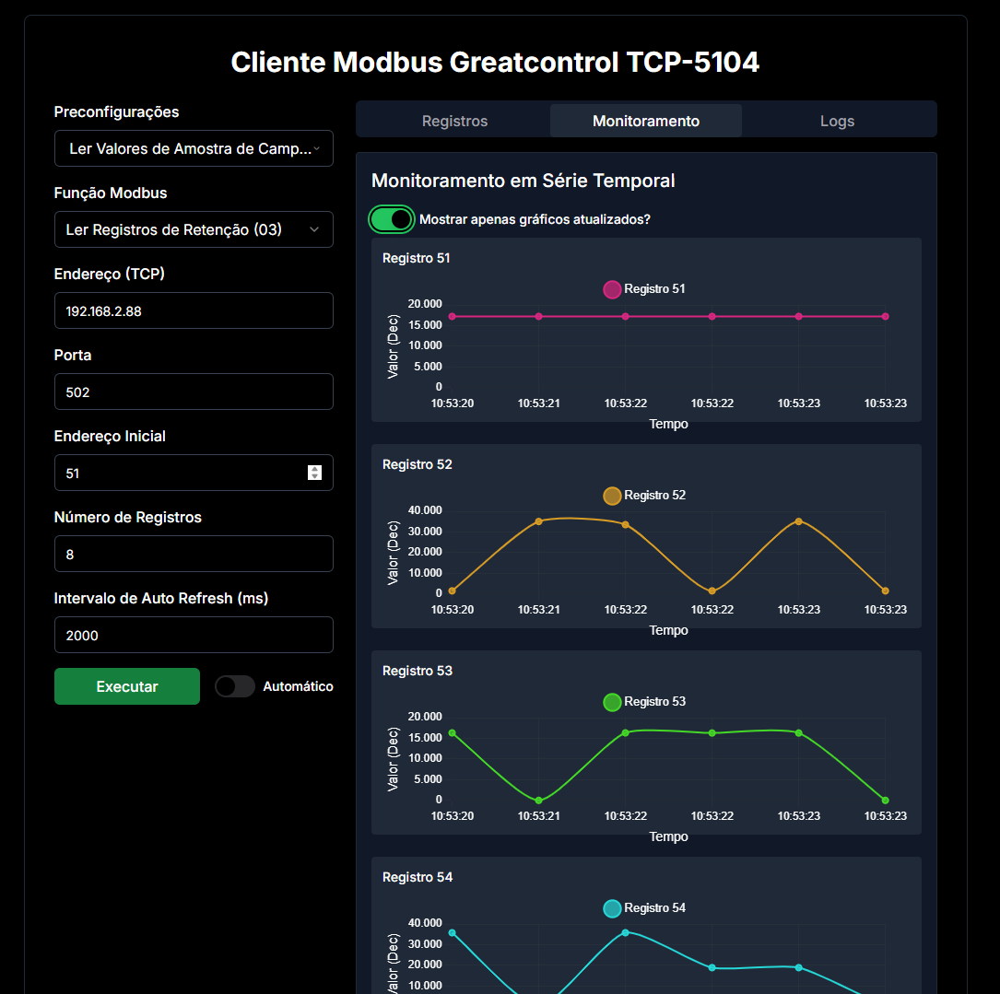
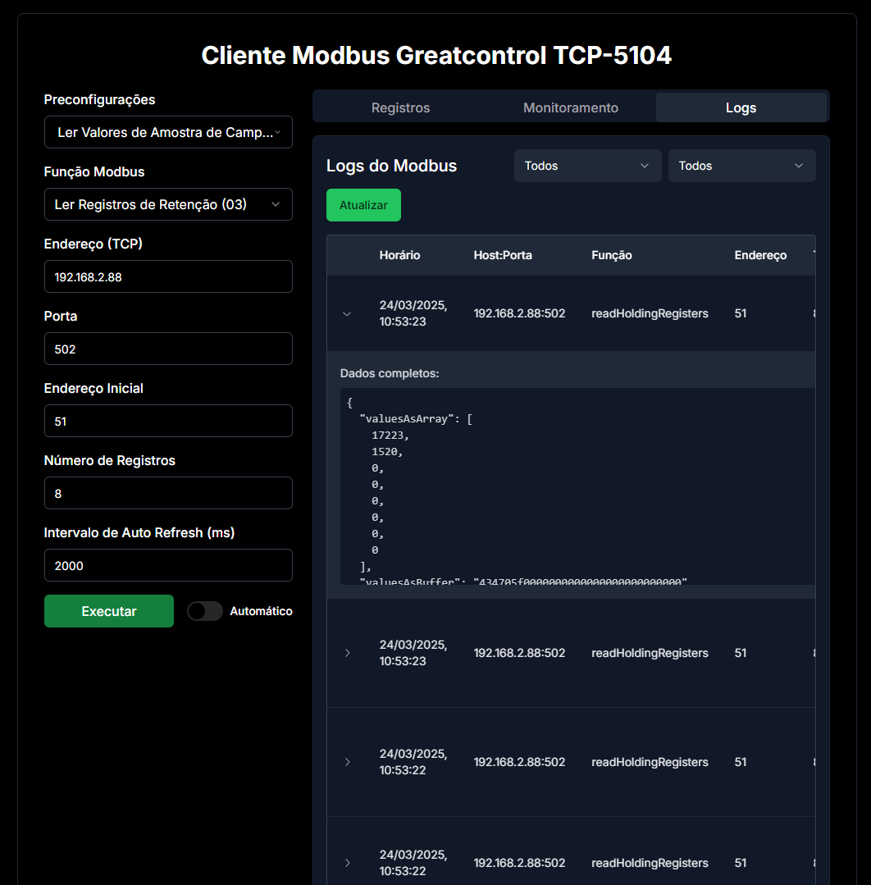

# Cliente Modbus Greatcontrol TCP-5104
- Uma ferramenta construída em React com Next.js e TailwindCSS com PostCSS para comunicação com um dispositivo Greatcontrol TCP-5104 via Modbus TCP que permite a leitura e monitoramento de registros, salvando os dados em um banco de dados PostgreSQL.
- Desenvolvido durante meu estágio na Companhia de Saneamento do Pará (COSANPA) como estágiario em desenvolvimento de software full-stack.
> Aviso: esse projeto tem presets para o Modbus Greatcontrol TCP-5104, mas pode ser facilmente adaptado para outros dispositivos Modbus.

## Características
- Envia solicitações Modbus TCP.
- Lê e exibe valores de registradores em tempo real.
- Monitora registros de dispositivos Modbus em uma interface gráfica.

## Capturas de Tela






## Como configurar
1. **Clone o repositório**:
   ```bash
   git clone https://github.com/jhermesn/cliente-modbus-greatcontrol-tcp-5104.git
   ```
2. **Instale as dependências**:
   ```bash
   npm install
   ```
3. **Rode o servidor de desenvolvimento**:
   ```bash
   npm run dev
   ```

## Uso
1. Acesse por meio do link `http://localhost:3000`.
2. Configure os parâmetros de conexão de acordo com o seu dispositivo.
3. Selecione a função Modbus e preencha os campos de solicitação.
4. Pronto para uso! Os valores dos registros serão exibidos na tela.

## Licença
- Este projeto está licenciado sob a [licença MIT](LICENSE).